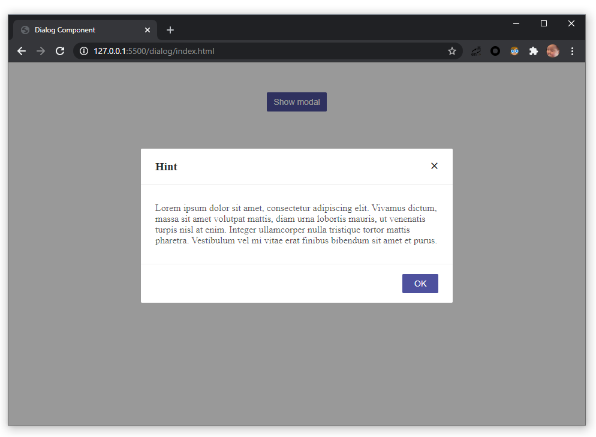

# Vanilla Components

Simple components implemented using vanilla JavaScript.

## Tooltip

### Usage

```html
<span id="paragraph">
  Lorem ipsum dolor sit amet, consectetur adipiscing elit.
</span>
```

```javascript
const tooltip = new Tooltip({
  selector: "#paragraph",
  title: "Hints here with top position!",
  placement: Tooltip.POSITION.TOP,
  color: "#4e519e",
});
```

Parameters:
| Property | Description | Type | Required | Default |
| --------- | ------------------------------------------------------------ | ------ | -------- | -------------------- |
| selector | The element that needs tooltip | string | ✓ | - |
| title | The text shown in the tooltip | string | ✗ | 'Hints' |
| placement | The position of the tooltip relative to the target, which can be one of `top` 、`left` 、`right`、 `bottom` | string | ✗ | Tooltip.POSITION.TOP |
| color | The background color | string | ✗ | '#404040' |

### Screenshots


## Dialog

### Usage

```html
<button id="show-modal-btn">
  Show modal
</button>
```

```javascript
const dialog = new Dialog({
  title: "提示",
  content: "请前往9¾月台乘坐霍格沃兹特快列车。",
  type: Dialog.TYPE.CONFIRM,
  options: {
    okText: "确定",
    cancelText: "取消",
  },
});

document.querySelector("#show-modal-btn").addEventListener("click", () => {
  dialog.open();
});
```

Parameters:
| Property | Description | Type | Required | Default |
| ------------ | ------------------------------------------------------------ | -------- | -------- | ------------------- |
| title | The modal dialog's title | string | ✗ | 'Hint' |
| content | The modal dialog's content | string | ✗ | 'Default Content' |
| type | The type of the modal dialog, which can be one of `message`、`confirm` | string | ✗ | Dialog.TYPE.MESSAGE |
| maskClosable | Whether to close the modal dialog when the mask (area outside the modal) is clicked | boolean | ✗ | true |
| keyboard | Whether support press esc to close | boolean | ✗ | true |
| okText | Text of the OK button | string | ✗ | 'OK' |
| cancelText | Text of the Cancel button | string | ✗ | 'Cancel' |
| onOk | Specify a function that will be called when a user clicks the OK button | function | ✗ | Dialog.close |
| onCancel | Specify a function that will be called when a user clicks the Cancel button | function | ✗ | Dialog.close |

### Screenshots




## Tab

### Usage

```html
<div id="whole-stuff">
  <div>
    <span>Tab 1</span>
    <span>Tab 2</span>
    <span>Tab 3</span>
  </div>
  <div>
    <div>
      <h3>Title of Tab Pane 1</h3>
      <p>Content of Tab Pane 1</p>
    </div>
    <div>
      <h3>Title of Tab Pane 2</h3>
      <p>Content of Tab Pane 2</p>
    </div>
    <div>
      <h3>Title of Tab Pane 3</h3>
      <p>Content of Tab Pane 3</p>
    </div>
  </div>
</div>
```

```javascript
const tab = new Tab({ selector: "#whole-stuff" });
```

Parameters:
| Property | Description | Type | Required | Default |
| ---------------- | --------------------------------------------------- | ------ | -------- | ---------------- |
| selector | The element that needs to be rendered as a tab | string | ✓ | - |
| defaultActiveKey | Initial active tab pane's key | number | ✗ | 0 |
| position | Position of tabs, which can be oen of `top`、`left` | string | ✗ | Tab.POSITION.TOP |

### Screenshots


